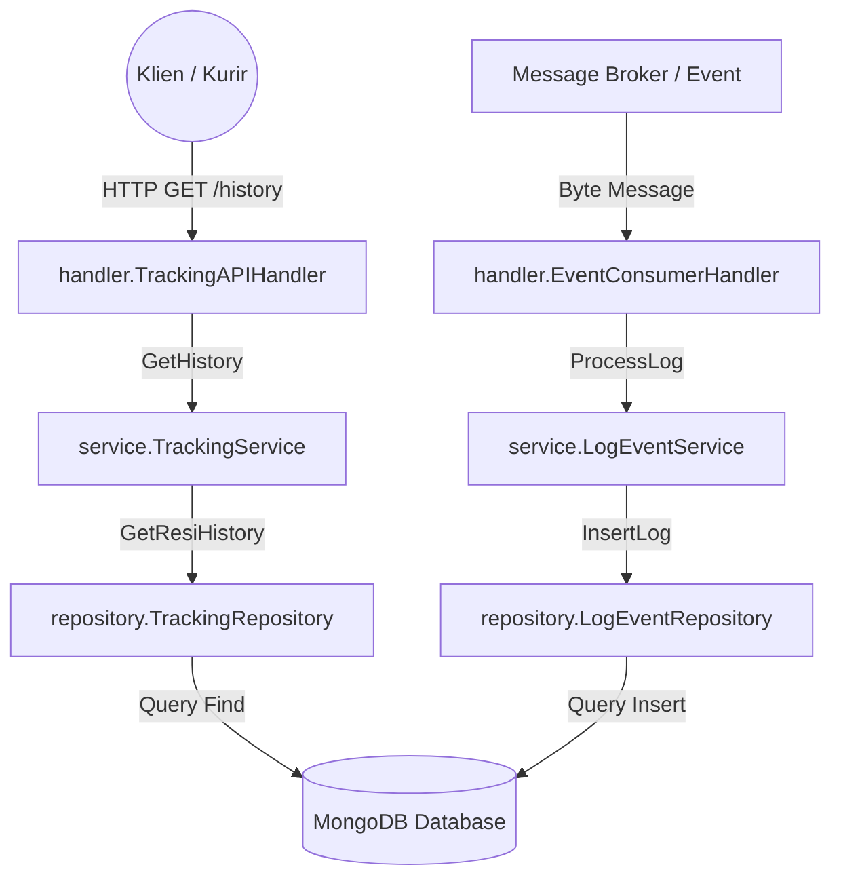

# 📦 MamangPermen - Tracking Service

[](https://golang.org)
[](https://www.mongodb.com)
[](https://www.docker.com)
[](https://kubernetes.io)

**Tracking Service** adalah layanan backend performa tinggi yang dirancang khusus untuk memproses dan melacak riwayat transit pengiriman barang (paket/resi) secara *real-time*. Layanan ini menerapkan arsitektur bersih (*Clean Architecture*) berbasis **Go (Golang)** dan menggunakan **MongoDB** sebagai media penyimpanan NoSQL yang sangat cocok untuk operasi dengan beban kerja tinggi (*Write-Heavy* dan *Read-Heavy*).

Layanan ini juga dilengkapi dengan integrasi CI/CD modern menggunakan **Jenkins Pipeline** serta siap dideploy ke **Kubernetes (K8s)** menggunakan manifest kontainerisasi **Docker**.

---

## 🚀 Fitur Utama

- **Real-Time Log Ingestion**: Menerima dan memproses *scanning log* dari berbagai titik transit logistik melalui Event Consumer.
- **Tracking History Retrieval**: API HTTP berlatensi rendah untuk menampilkan riwayat pelacakan lengkap dari suatu nomor resi.
- **Clean Architecture & SOLID Principles**: Pemisahan tanggung jawab yang jelas antara model data, logika bisnis (use case), repositori data, dan handler transportasi (HTTP & Event).
- **Automated CI/CD Pipeline**: Pipeline Jenkins multi-tahap lengkap dari pengujian, kompilasi, pembuatan image kontainer, hingga otomasi deploy Kubernetes.
- **High Availability & Scalability**: Deployment Kubernetes terkonfigurasi dengan replikasi pod (*high availability*) dan penyeimbang beban (*ClusterIP Service*).

---

## 📁 Struktur Proyek (Clean Architecture)

Proyek ini terbagi menjadi beberapa modul utama yang menerapkan pemisahan tugas secara terisolasi:

```text
tracking-service/
├── cmd/
│   └── main.go                  # Entry point utama aplikasi
├── internal/
│   ├── handler/
│   │   ├── api.go               # HTTP API handler untuk permintaan klien (e.g. GET /history)
│   │   └── event.go             # Event Consumer untuk memproses log transit dari message broker
│   ├── model/
│   │   └── log.go               # Model data tracking log & tracking history (BSON/JSON mapping)
│   ├── repository/
│   │   ├── errors.go            # Definisi error standar di tingkat data layer
│   │   ├── log_event.go         # Interface LogEventRepository (Write-Heavy)
│   │   ├── tracking.go          # Interface TrackingRepository (Read-Heavy)
│   │   ├── mongo_log_event_repo.go # Implementasi MongoDB untuk LogEventRepository (TBD)
│   │   ├── mongo_tracking_repo.go  # Implementasi MongoDB untuk TrackingRepository (TBD)
│   │   └── mock/                # Mock files generated untuk unit testing
│   └── service/
│       ├── log_event_svc.go     # Logika bisnis pemrosesan log & validasi awal
│       └── tracking_svc.go      # Logika bisnis pengambilan data riwayat pelacakan resi
├── k8s/
│   ├── deployment.yaml          # Spesifikasi Kubernetes Deployment (2 replicas, Port 8080)
│   └── service.yaml             # Spesifikasi Kubernetes ClusterIP Service (Port 80 -> 8080)
├── Dockerfile                   # Multi-stage Docker build untuk image Alpine yang minimalis
├── Jenkinsfile                  # Konfigurasi otomasi CI/CD Jenkins Pipeline
├── go.mod                       # Modul Go & definisi dependensi pihak ketiga
└── go.sum                       # Checksum dependensi Go
```

### Arsitektur Aliran Data:


---

## 🛠️ Spesifikasi Data & API

### 1. Model Data (`TrackingLog` & `TrackingHistory`)

Layanan ini mengelola data pelacakan dengan struktur sebagai berikut:

* **TrackingLog (Log Transit Tunggal)**
  ```json
  {
    "resi_id": "RESI-123456",
    "location_code": "CGK-1",
    "activity_code": "RECEIVED_AT_TRANSIT",
    "photo_url": "https://storage.mamangpermen.com/photos/resi-123456.jpg",
    "timestamp": "2026-06-02T14:18:54Z"
  }
  ```

* **TrackingHistory (Riwayat Pelacakan Paket)**
  ```json
  {
    "resi_id": "RESI-123456",
    "history": [
      {
        "resi_id": "RESI-123456",
        "location_code": "CGK-1",
        "activity_code": "RECEIVED_AT_TRANSIT",
        "photo_url": "https://storage.mamangpermen.com/photos/resi-123456.jpg",
        "timestamp": "2026-06-02T14:18:54Z"
      }
    ]
  }
  ```

### 2. HTTP Endpoint Pelacakan
- **Endpoint**: `GET /history`
- **Query Parameter**: `resi_id` (Wajib)
- **Response**: `200 OK` berupa objek `TrackingHistory` atau `400 Bad Request` / `500 Internal Server Error`.

### 3. Event Consumer
- **Handler**: `ConsumeLogEvent(message []byte)`
- **Deskripsi**: Mengonsumsi pesan byte berformat JSON dari antrean log, melakukan unmarshal ke `model.TrackingLog`, memvalidasi data, kemudian menyimpannya ke database MongoDB.

---

## 💻 Cara Menjalankan Project

### Prasyarat
Sebelum memulai, pastikan perangkat Anda telah terpasang:
- **Go** (versi 1.21 ke atas direkomendasikan, sistem menggunakan `1.26.2`)
- **MongoDB** (berjalan lokal di port default `27017` atau cloud URI)
- **Docker** & **Kubernetes** (opsional, untuk deployment kontainer)

### 1. Menjalankan Secara Lokal
Unduh semua dependensi terlebih dahulu:
```bash
go mod download
```
Jalankan aplikasi utama:
```bash
go run cmd/main.go
```
*Catatan: Saat ini `cmd/main.go` berfungsi sebagai cetak biru inisialisasi awal server.*

### 2. Menjalankan Pengujian (Testing)
Proyek ini mengadopsi dua jenis pengujian yang terpisah berdasarkan *build tags*:

* **Unit Test (Menggunakan Mock Repo)**
  Unit test menguji logika bisnis pada tingkat `service` secara terisolasi menggunakan mock repository bawaan GoMock.
  ```bash
  go test ./... -v
  ```

* **Functional Test (Memerlukan Integrasi MongoDB Nyata)**
  Functional test memverifikasi alur e2e (End-to-End) dari service hingga database. Dijalankan menggunakan tag `functional`:
  ```bash
  go test -tags=functional ./internal/service -v
  ```
  *(Catatan: Pengujian fungsional ini dikonfigurasikan gagal secara terkendali karena implementasi query MongoDB sesungguhnya sedang dalam proses penyelesaian).*

---

## 🐳 Kontainerisasi & CI/CD Deployment

### 1. Docker Build
Aplikasi dikemas menggunakan teknik **Multi-stage Build** untuk memisahkan lingkungan *compiler* dan *runtime*, sehingga ukuran image akhir sangat ringan dan aman (menggunakan Alpine Linux).

```bash
docker build -t tracking-service:latest .
```

### 2. Jenkins Pipeline (`Jenkinsfile`)
Siklus hidup deployment otomatis diatur oleh Jenkins melalui pipeline utama dengan tahapan berikut:
1. **Checkout**: Mengunduh kode sumber terbaru dari Repositori Git.
2. **Prepare**: Mengunduh semua dependensi eksternal proyek Go.
3. **Unit Test**: Menjalankan pengujian logika bisnis secara unit.
4. **Lint/Vet**: Memvalidasi kode menggunakan parser statis `go vet`.
5. **Build Image**: Memproduksi image Docker dengan tag nomor build dan tag `latest`.
6. **Functional Test**: Menjalankan integrasi pengujian fungsional database.
7. **Push Image**: Mengirimkan image Docker yang sukses diuji ke Container Registry.
8. **Deploy K8s**: Menerapkan konfigurasi manifes Kubernetes ke cluster tujuan.
9. **Verify**: Menunggu status peluncuran Kubernetes (`kubectl rollout status`) untuk memastikan layanan berjalan tanpa kendala.

### 3. Deploy Kubernetes (`k8s/`)
Layanan dideploy dalam cluster Kubernetes menggunakan konfigurasi deklaratif berikut:
- **`k8s/deployment.yaml`**: Membuat deployment bernama `tracking-service` dengan **2 buah replika pod** aktif demi kehandalan layanan (*High Availability*), mendengarkan di kontainer port `8080`.
- **`k8s/service.yaml`**: Menyediakan layanan dengan tipe **ClusterIP`** bernama `tracking-service-svc` yang menyeimbangkan beban dari port `80` internal cluster ke port kontainer `8080`.

---

## 🛠️ Status Pengembangan & Roadmap (TODO)

| Modul | Status | Keterangan |
| :--- | :---: | :--- |
| **Arsitektur Dasar** | ✅ | Struktur Clean Architecture selesai dirancang |
| **Model Data** | ✅ | Skema JSON & BSON MongoDB selesai diintegrasikan |
| **Unit Testing & Mocking** | ✅ | Skenario pengujian logika bisnis dan mock repository siap digunakan |
| **CI/CD & Jenkins Pipeline** | ✅ | Build pipeline siap pakai di lingkungan automasi |
| **Kubernetes & Dockerfile** | ✅ | Konfigurasi kontainerisasi & orkestrasi siap dideploy |
| **MongoDB Implementation** | ⚠️ *In Progress* | Query insert database (`InsertLog`) dan query find (`GetResiHistory`) perlu diselesaikan di modul `repository` |

---

## 🧑‍💻 Kontributor

- **MamangPermen** - *Tim Pengembang Cloud & Core Logistik*
